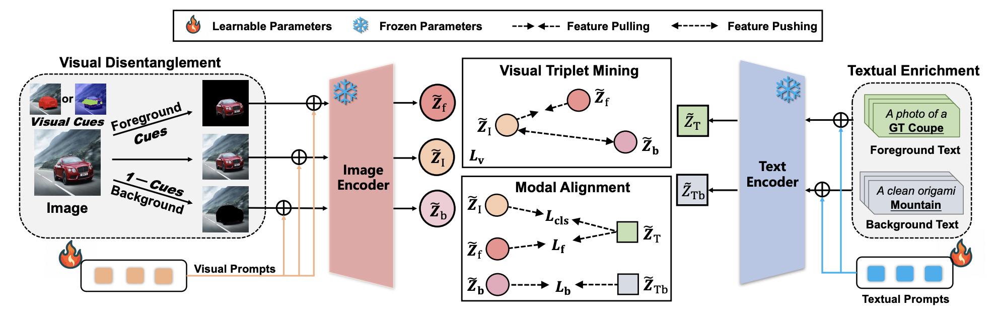
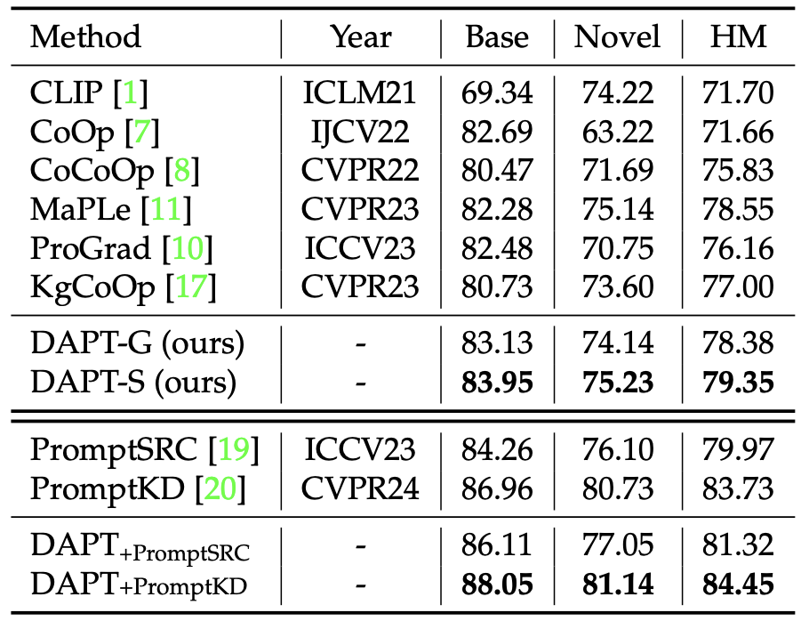

# DAPT [T-PAMI 2025]


> [**Decouple before Align: Visual Disentanglement Enhances Prompt Tuning**](https://arxiv.org/pdf/2508.00395)<br>
> [Fei Zhang](https://scholar.google.com/citations?hl=zh-CN&user=Omrg6UkAAAAJ), [Tianfei Zhou](https://www.tfzhou.com/), [Jiangchao Yao](https://sunarker.github.io/), [Ya Zhang](http://scholar.google.com/citations?user=pbjw9sMAAAAJ&hl=zh-CN), [Ivor W. Tsang](https://scholar.google.com.sg/citations?user=rJMOlVsAAAAJ&hl=en), [Yanfeng Wang](https://ieeexplore.ieee.org/author/37085615187)


Official implementation of the paper "[Decouple before Align: Visual Disentanglement
Enhances Prompt Tuning](https://arxiv.org/pdf/2508.00395)".


## Highlights


> **<p align="justify"> Abstract:** *Prompt tuning (PT), as an emerging resource-efficient fine-tuning paradigm, has showcased remarkable effectiveness in
improving the task-specific transferability of vision-language models. This paper delves into a previously overlooked information
asymmetry issue in PT, where the visual modality mostly conveys more context than the object-oriented textual modality. Correspondingly,
coarsely aligning these two modalities could result in the biased attention, driving the model to merely focus on the context area. To
address this, we propose DAPT, an effective PT framework based on an intuitive decouple-before-align concept. First, we propose to
explicitly decouple the visual modality into the foreground and background representation via exploiting coarse-and-fine visual
segmenting cues, and then both of these decoupled patterns are aligned with the original foreground texts and the hand-crafted
background classes, thereby symmetrically strengthening the modal alignment. To further enhance the visual concentration, we propose
a visual pull-push regularization tailored for the foreground-background patterns, directing the original visual representation towards
unbiased attention on the region-of-interest object. We demonstrate the power of architecture-free DAPT through few-shot learning,
base-to-novel generalization, and data-efficient learning, all of which yield superior performance across prevailing benchmarks.* </p>

## Main Contributions

1) **Multi-modal prompt learning:** Adapt CLIP using a novel prompting technique which prompts both the vision and language branch of CLIP.
2) **Vision Decoupling:**  We propose the visual disentanglement that exploits the
visual cues of different levels to highlight the text-oriented
object in the visual modality.
3) **Fine-grained v.s. Coarse Visual Decoupling:** Different Masks are explored to serve effective decoupling visual signal.

## Results
>SOTA performance is made, and such a method could be seamlessly integrated on other methods.




## Installation 
For installation and other package requirements, please follow the instructions detailed in [INSTALL.md](docs/INSTALL.md). 

## Data preparation
Please follow the instructions at [DATASETS.md](docs/DATASETS.md) to prepare all datasets.


**DAPT-S**: Then, you should download the **Segementation MASK** from [Here](https://drive.google.com/file/d/12BDM8X3ZynLVNqmkAMEvxVMk7vU9ILzv/view?usp=sharing), and put them correspondingly to each root data directory.

These masks are generated with [SEEM](https://github.com/UX-Decoder/Segment-Everything-Everywhere-All-At-Once), and you can also generate masks by other tools, Just suit yourself.

(PS: It contains all segmentation masks for ImageNet, so it is convenient to use them for other studies)


## Training and Evaluation
Please refer to the [RUN.md](docs/RUN.md) for detailed instructions on training, evaluating and reproducing the results using our pre-trained models. (All implementations could also refer to [MaPLe](https://github.com/muzairkhattak/multimodal-prompt-learning/tree/main))


<hr />

## Citation
If you use our work, please consider citing:
```bibtex
@ARTICLE{11106768,
  author={Zhang, Fei and Zhou, Tianfei and Yao, Jiangchao and Zhang, Ya and Tsang, Ivor W. and Wang, Yanfeng},
  journal={IEEE Transactions on Pattern Analysis and Machine Intelligence}, 
  title={Decouple Before Align: Visual Disentanglement Enhances Prompt Tuning}, 
  year={2025},
  volume={47},
  number={11},
  pages={10619-10632},
  keywords={Visualization;Tuning;Semantics;Artificial intelligence;Object oriented modeling;Accuracy;Image recognition;Context modeling;Training;Technological innovation;Prompt tuning;visual disentanglement;multi-modal learning},
  doi={10.1109/TPAMI.2025.3594894}}
```

## Contact
If you have any questions, please create an issue on this repository or contact at ferenas@sjtu.edu.cn.


## Acknowledgements

Our code is based on [MaPLe](https://github.com/muzairkhattak/multimodal-prompt-learning/tree/main) repository. We thank the authors for releasing their code. If you use our model and code, please consider citing these works as well.

